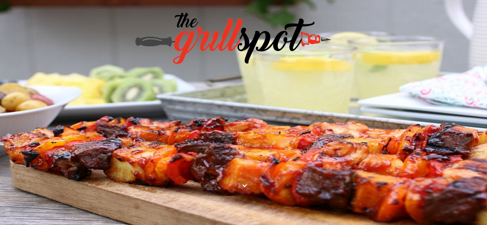
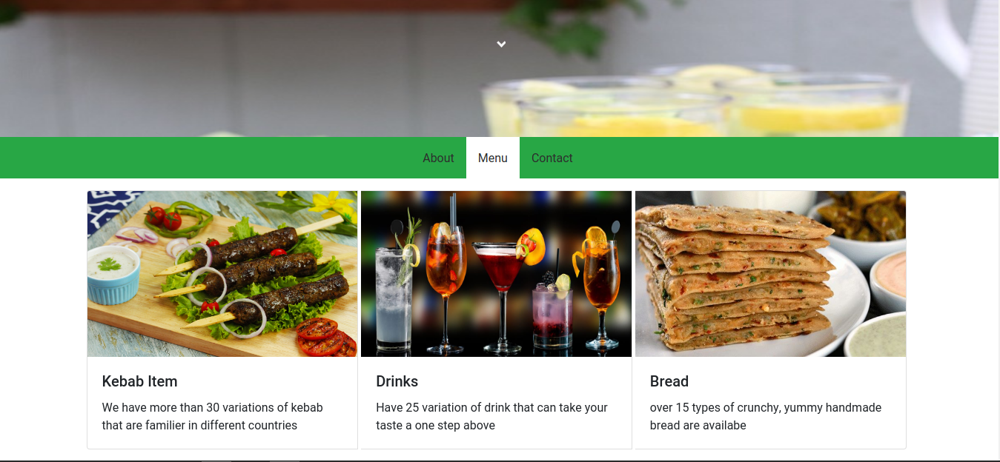

<h1 align="center">Restaurant App 👋</h1>

The project is a solid structure for a more complex web app. User can access the menu with a pleasant view. 
## Set up

To run the project:

- Clone the repository: https://github.com/shshamim63/restaurant-app
- Run `cd restaurant-app` to enter into project folder. 
- Run `npm install` It will install all the dependencies required by the project
- Run `npm start` to start the development server. It will automatically open the page in your default browser.
- Run `npm run build` to get a deployable version.

## Deployment
[Live Demo](https://kababworld.netlify.com/)

## Screenshots
Home Page

Menu Page

## Contributor

👤 **Shakhawat Hossain**
- Github: [@shshamim63](https://github.com/shshamim63)
- LinkedIn: [@shakhawathossainshamim](https://www.linkedin.com/in/shakhawathossainshamim/)
- Twitter: [@Shshamim090](https://twitter.com/Shshamim090)

# Potential Future Features

- **Adding sub-menu list**
- **User can order food**
- **Add order confirmation**

# Contribute

Always welcome to contribute if you want to make it better.
## 🤝 Contributing

1. Fork it (https://github.com/shshamim63/restaurant-app)
2. Create your feature branch (git checkout -b feature/[choose-a-name])
3. Commit your changes (git commit -am 'what this commit will fix/add')
4. Push to the branch (git push origin feature/[chosen-name])
5. Create a new Pull Request

## License

This project is licensed under the MIT License - see the [LICENSE](./LICENSE) file for details